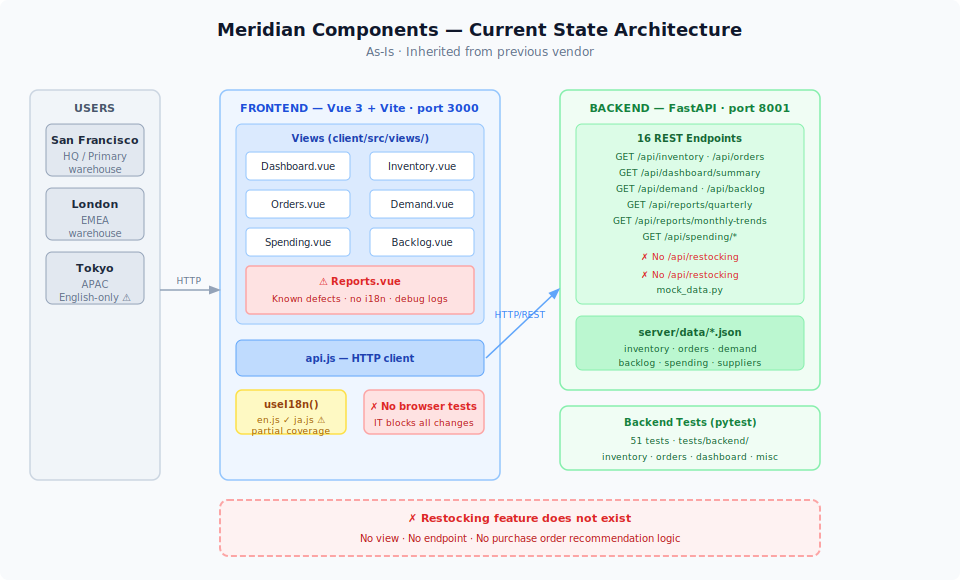
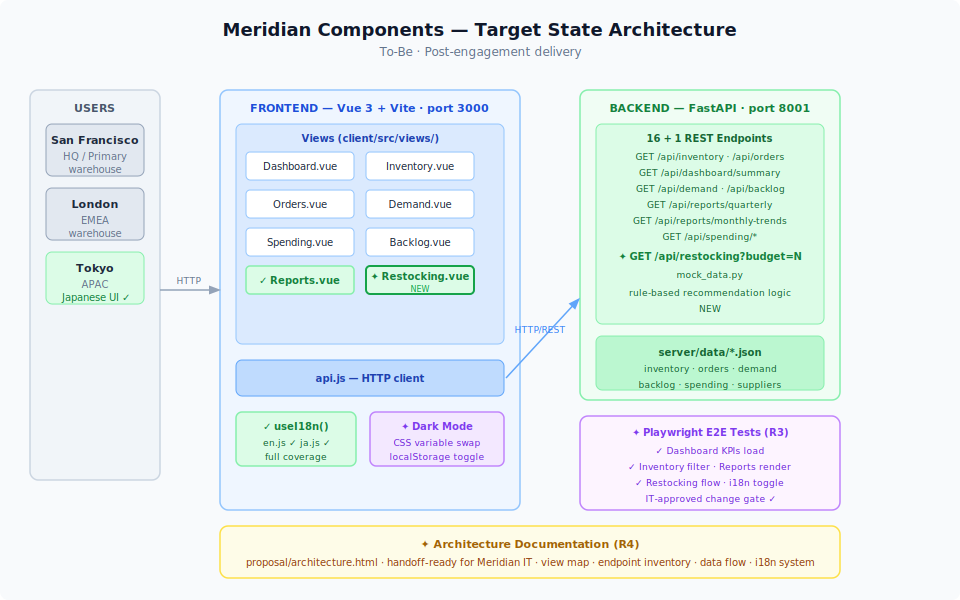
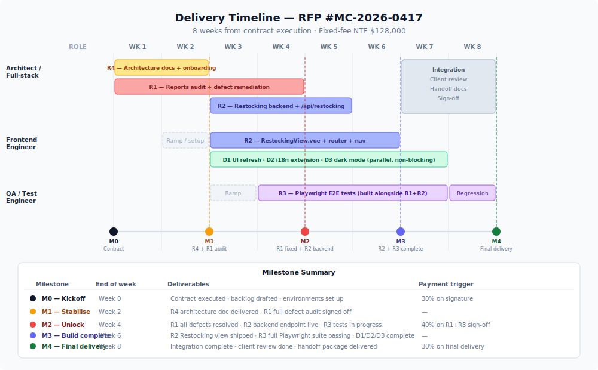

# Technical Approach

**RFP #MC-2026-0417 — Inventory Dashboard Modernization**

---

We audited the existing codebase as part of proposal scoping. What follows reflects what is actually in the system — not the previous vendor's handoff notes, which are incomplete. Our approach is grounded in this first-hand review.

---

## Architecture: As-Is vs. To-Be

The diagrams below show the current state inherited from the previous vendor and the target state we will deliver.

**As-Is** — [architecture-as-is.svg](architecture-as-is.svg)


**To-Be** — [architecture-to-be.svg](architecture-to-be.svg)


The foundation is sound: Vue 3 Composition API on the frontend, FastAPI with 16 REST endpoints on the backend, JSON flat files for data. The issues are in the layer above — incomplete feature work, missing tests, and undocumented architecture. These are fixable.

---

## R1 — Reports Module Remediation

**What we found.** The Reports view has multiple defects that the previous vendor left unresolved:

- No i18n integration — all text is hardcoded; the existing `useI18n()` composable is not used
- Manual number formatting (`formatNumber()`) and hardcoded month name arrays — duplicates logic already available in locale utilities
- Multiple `console.log()` debug calls left in production code
- No retry mechanism on the error state
- Summary stat and chart height calculations are inline in the view rather than in computed properties

**Our approach.** We will conduct a full defect audit against both the code and the running application, then resolve each category:

1. Wire the existing `useI18n()` composable into Reports — no new infrastructure needed
2. Replace manual formatters with locale-aware utilities
3. Remove debug logging
4. Extract calculation logic to computed properties
5. Add error retry

We will verify all fixes against the existing backend endpoints (`/api/reports/quarterly`, `/api/reports/monthly-trends`).

---

## R2 — Restocking Recommendations

**What we found.** No Restocking view or endpoint exists. The backend already defines `BacklogItem` and `PurchaseOrder` models, and demand data is available at `/api/demand`, inventory at `/api/inventory`. The data is there — it just hasn't been wired together.

**Our approach.**

*Backend:* New endpoint `/api/restocking` — accepts a warehouse filter and budget ceiling, cross-references current stock levels against demand forecasts, and returns ranked purchase order recommendations within the budget.

*Frontend:* New `RestockingView.vue` — warehouse selector, budget ceiling input, recommendations table (item, current stock, recommended quantity, unit cost, subtotal), running total vs. budget indicator. Wired into Vue Router and the navigation bar.

The recommendation logic is rule-based: flag items where current stock falls below the reorder threshold implied by demand, rank by criticality, truncate to budget ceiling.

---

## R3 — Automated Browser Testing

**What we found.** The project has 51 backend API tests (pytest, in `tests/backend/`). There are zero frontend or end-to-end tests — which is why Meridian IT has been reluctant to approve changes.

**Our approach.** We will write Playwright end-to-end tests covering the critical user flows. The Playwright MCP server is already configured in this repo.

```
Critical flows covered:
  ✓ Dashboard  →  KPI summary cards load with valid data
  ✓ Inventory  →  warehouse + category filter returns correct results
  ✓ Reports    →  quarterly table + monthly chart render without errors
  ✓ Restocking →  budget input → recommendations table populates
  ✓ i18n       →  EN/JP language toggle → key strings change correctly
```

Tests will be written to run against the local dev server and will be repeatable in CI. Once R3 is in place, IT has a verified gate for approving future changes.

---

## R4 — Architecture Documentation

**What we found.** No architecture documentation exists. The previous vendor's handoff was a single page of file paths and stack notes — insufficient for IT onboarding or future vendor transitions.

**Our approach.** We will deliver a visual architecture overview at `proposal/architecture.html` covering:

- Frontend view map and routing
- Full API endpoint inventory (16 endpoints, filters, data models)
- Data flow: Vue filters → `api.js` → FastAPI → JSON files → Pydantic models → computed properties
- i18n system structure
- Deployment topology (ports, startup, dependencies)

This document is produced during onboarding and kept current through delivery — it is a byproduct of our working practice, not a bolt-on at the end.

---

## D1 — UI Modernization

**What we found.** Design tokens are already defined: a slate/gray palette (`#0f172a`, `#64748b`, `#e2e8f0`), status colors (green/blue/yellow/red), CSS Grid layouts, and custom SVG charts.

**Our approach.** Refresh typography, spacing, and component consistency using the existing token system. We will not introduce a UI framework — the goal is a cleaner, more consistent application of what's already there, not a rewrite.

---

## D2 — Internationalization

**What we found.** A custom `useI18n()` composable and locale files (`en.js`, `ja.js`) already exist with 300+ keys covering navigation, inventory, orders, and finance. Reports.vue does not use them. Some other views are partially covered.

**Our approach.** Audit all views for hardcoded strings → replace with `t()` calls → extend `ja.js` for any missing keys. The composable handles currency switching (USD/JPY) automatically when locale changes.

---

## D3 — Dark Mode

**What we found.** A single light theme exists. CSS variables are in use throughout.

**Our approach.** Implement a `data-theme` attribute on the `<html>` element. Dark theme values are defined as a CSS variable override set. The operator's preference is stored in `localStorage` and restored on load. No framework change required.

---

## Delivery Sequence

See [timeline.svg](timeline.svg) for the full visual timeline with milestones.



| Milestone | End of week | What's delivered |
|-----------|-------------|-----------------|
| M0 — Kickoff | Week 0 | Contract signed · backlog drafted · environments set up |
| M1 — Stabilise | Week 2 | R4 architecture doc · R1 defect audit signed off |
| M2 — Unlock | Week 4 | R1 all defects resolved · R2 backend live · R3 in progress |
| M3 — Build complete | Week 6 | R2 Restocking view · R3 full Playwright suite · D1/D2/D3 done |
| M4 — Final delivery | Week 8 | Integration · client review · handoff package |

Required items (R1–R4) are complete before desired items (D1–D3) ship. Desired items run as parallel workstreams and do not affect the required delivery date.

---

## Estimated Cost

| Role | Rate | Hours | Subtotal |
|------|------|-------|---------|
| Architect / Full-stack engineer | $175/hr | 320 hrs (8 weeks × 40) | $56,000 |
| Frontend engineer | $140/hr | 280 hrs (7 weeks × 40) | $39,200 |
| QA / test engineer | $115/hr | 240 hrs (6 weeks × 40) | $27,600 |
| **Total (T&M basis)** | | **840 hrs** | **$122,800** |

**Fixed-fee proposal: $128,000 (not-to-exceed)**

The $5,200 buffer (~4%) covers coordination overhead and a limited round of post-delivery revisions. Desired items D1–D3 are included within this fixed fee — if Meridian chooses to descope them, pricing is unchanged (they are delivered in parallel by the frontend engineer without extending the timeline).

*Payment milestones: 30% on contract execution · 40% on R1+R3 sign-off · 30% on final delivery.*

---

## Assumptions

| # | Assumption |
|---|-----------|
| A1 | No database migration required — flat JSON data files retained throughout |
| A2 | Restocking recommendations are rule-based (stock vs. demand threshold), not ML |
| A3 | "Critical flows" for R3 are as defined above, absent a client-provided specification |
| A4 | D1–D3 are best-effort within the 8-week window; required items take priority if schedule pressure arises |
| A5 | UI modernization (D1) uses Meridian's existing design token palette unless brand guidelines are provided |
